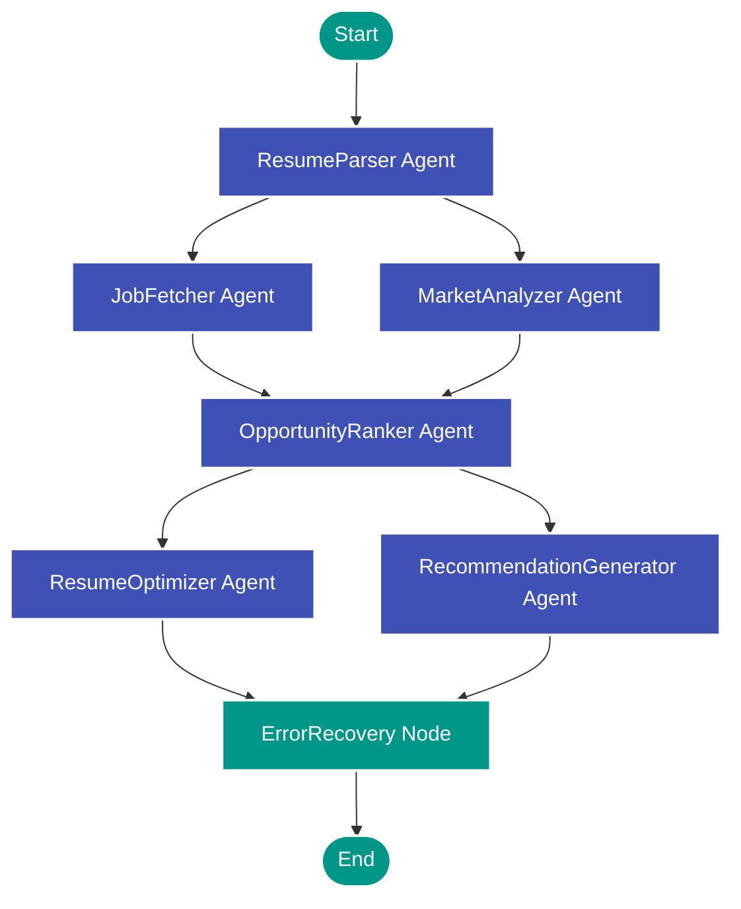

# 🚀 NEXUS 2.0 (NexusTalent AI)

An enterprise-grade, multi-agent AI career intelligence engine and real-time job matching dashboard. NEXUS 2.0 is powered by **LangChain LangGraph**, **Google Genkit**, **Next.js 15**, and **Groq** (`llama-3.3-70b-versatile`).

---

<p align="center">
  
  
  
  
  
  
</p>

---

## 📖 Overview

**NEXUS 2.0** is a dual-mode, AI-driven career companion that transforms how job seekers optimize their applications and discover opportunities:

1. **ATS Diagnostics Simulator (Single-Role Mode)**: Simulates enterprise Applicant Tracking Systems (ATS) by calculating shortlisting probability based on semantic fit, penalizing missing hard requirements, and recommending time-bounded, job-specific learning paths.
2. **Job Intelligence Dashboard (Multi-Agent Feed)**: Aggregates real-time listings across multiple job boards, parses candidate profiles from uploaded PDFs, and maps candidates to matching roles using a collaborative multi-agent graph with deep reasoning telemetry.

---

## ✨ Core Features

*   **ATS Simulation & Shortlist Estimator**: Evaluates resume text against job descriptions using a structured scoring philosophy (30% Skill Match, 30% Experience Depth, 20% Tooling, 20% Industry Context).
*   **Real-time Job Sourcing**: Searches, cleans, filters, and deduplicates listings from public API channels (JSearch, Adzuna, Remotive, Arbeitnow, and SerpApi).
*   **Deep Skills Gap Analysis**: Flags missing critical tools, certifications, and experience levels, providing an honest, meta-level explanation of rejection vectors.
*   **Tailored Learning Pathways**: Creates learning recommendations focusing on hands-on content (e.g. YouTube queries, estimated upskilling times, and documentation).
*   **Agentic Resume Optimizer**: Suggests bullet-point rewrites by transforming passive sentences into metrics-driven, action-verb-oriented bullet points suitable for ATS crawlers.
*   **Interactive Telemetry Dashboard**: Persists listings and matches inside a unified storage manager (Firebase Firestore or Local JSON fallback) and visualizes ATS stats using dynamic charts.

---

## 🤖 Multi-Agent Graph Architecture

NEXUS 2.0 utilizes **LangChain LangGraph** to define an asynchronous, state-annotated pipeline that coordinates 6 specialized agents, structured with parallel splits and merging nodes:



### State Annotation Channel Schema
The orchestration pipeline maintains a shared state container (`AgentStateAnnotation`) that collects and merges telemetry as nodes execute:
*   `resumeText` & `jobQuery`: Input vectors.
*   `profile`: Structured JSON format of parsed credentials.
*   `rawJobs`: Normalized job listings.
*   `marketAnalysis`: Salary bands and industry trend indicators.
*   `rankedOpportunities`: Detailed scoring outputs (reasoning, gaps, percentages).
*   `optimizedResumeSuggestions`: Actionable resume bullet rewrites.
*   `personalizedRecommendations`: Custom applications tactics and interview prep.
*   `logs` & `confidenceScores`: Observability tracers for UI logs.

### Agent Nodes
1.  **ResumeParser**: Extracts structured candidate parameters (experience, skills, tools) from raw text/PDF using structured Zod models.
2.  **JobFetcher**: Hits remote APIs concurrently to pull listings, filtering them dynamically for location restrictions and duplicate hashes.
3.  **MarketAnalyzer**: Assesses local salary curves, demand level (Low/Medium/High), and hiring companies using regional market heuristics.
4.  **OpportunityRanker**: Scores jobs in two stages—fast keyword filtering followed by deep semantic evaluation using Groq LLMs.
5.  **ResumeOptimizer**: Re-evaluates bullet points to align them with ATS requirements, creating before/after rewrites.
6.  **RecommendationGenerator**: Creates personalized cover letter strategies, career roadmaps, and STAR-method interview preparations.
7.  **ErrorRecovery**: Resiliency mechanism. If an upstream agent hits a rate limit or network timeout, the node catches the exception, registers the failure in the log tracer, and injects default mock structures so the user dashboard remains operational.

---

## 🛠️ Technology Stack

*   **Framework**: Next.js 15 (App Router with Server Actions)
*   **Languages**: TypeScript, JavaScript, CSS3
*   **Orchestration & AI SDKs**: LangChain LangGraph, Google Genkit
*   **Inference Model**: Groq (`llama-3.3-70b-versatile`) via OpenAI compatible middleware
*   **Styling & UI**: Tailwind CSS, Shadcn UI, Radix UI, Lucide icons
*   **Data Visualizations**: Recharts (dynamic responsiveness)
*   **Database**: Firebase Firestore Client / Local JSON Fallback DB Manager
*   **Deployment**: Firebase App Hosting (`apphosting.yaml`)

---

## 📁 Directory Structure

```
nexus-2.0/
├── doc/
│   └── blueprint.md            # Original app specification and style guidelines
├── src/
│   ├── ai/
│   │   ├── agents/             # Core agent logic (job-fetcher, matcher, resume-parser)
│   │   ├── flows/              # Genkit flows (ATS diagnostics, related job searches)
│   │   ├── orchestrator/       # LangGraph multi-agent orchestrator (graph definition, agent nodes)
│   │   ├── dev.ts              # Genkit dev environment entry point
│   │   └── genkit.ts           # Genkit initializer (Groq provider config)
│   ├── app/
│   │   ├── dashboard/          # Real-time Job Intelligence Dashboard route
│   │   ├── actions.ts          # Server Actions linking frontend to Genkit/LangGraph
│   │   ├── globals.css         # Styling system
│   │   ├── layout.tsx          # Application shell & providers
│   │   └── page.tsx            # ATS Diagnostics Landing Page
│   ├── components/
│   │   ├── ui/                 # Reusable layout assets (buttons, inputs, cards)
│   │   ├── analysis-form.tsx   # PDF/text upload and career settings control
│   │   ├── analysis-results.tsx# Diagnostic report view
│   │   └── job-dashboard.tsx   # Multi-agent graph telemetry visualization core
│   ├── context/                # History state providers
│   ├── hooks/                  # UI helper utilities
│   ├── lib/
│   │   ├── db.ts               # Storage Manager (Firebase Firestore & JSON Fallback)
│   │   ├── job-types.ts        # Shared typescript interfaces for job data
│   │   ├── llm-client.ts       # Structured output helper & Groq client middleware
│   │   └── utils.ts            # Formatting scripts
│   └── types/                  # Core types
├── apphosting.yaml             # Firebase App Hosting deployment configurations
├── components.json             # Shadcn configuration file
├── package.json                # Project dependencies
└── tsconfig.json               # TypeScript configuration
```

---

## ⚙️ Environment Configuration

Create a `.env` file in the root of your project directory and add the following keys:

```env
# Core LLM Engine (Required)
GROQ_API_KEY=your_groq_api_key_here

# Firebase Configuration (Optional - Falls back to local JSON database if empty)
NEXT_PUBLIC_FIREBASE_API_KEY=your_firebase_api_key
NEXT_PUBLIC_FIREBASE_AUTH_DOMAIN=your_firebase_auth_domain
NEXT_PUBLIC_FIREBASE_PROJECT_ID=your_firebase_project_id
NEXT_PUBLIC_FIREBASE_STORAGE_BUCKET=your_firebase_storage_bucket
NEXT_PUBLIC_FIREBASE_MESSAGING_SENDER_ID=your_firebase_messaging_sender_id
NEXT_PUBLIC_FIREBASE_APP_ID=your_firebase_app_id

# Job Sourcing API Credentials (Optional - Mock jobs are generated if keys are absent)
JSEARCH_API_KEY=your_rapidapi_jsearch_key
JSEARCH_MEGA_API_KEY=your_secondary_jsearch_key_for_load_balancing
ADZUNA_APP_ID=your_adzuna_app_id
ADZUNA_APP_KEY=your_adzuna_app_key
SERPAPI_API_KEY=your_serpapi_google_jobs_key
ARBEITNOW_API_KEY=your_arbeitnow_key
```

---

## 🚀 Getting Started

Follow these steps to run NEXUS 2.0 locally:

### 1. Pre-requisites
*   Node.js 18.x or above installed.
*   An active Groq API Key (Sign up at [console.groq.com](https://console.groq.com)).

### 2. Installation
```bash
# Clone the repository
git clone https://github.com/IamHari01/Nexus-2.0.git

# Navigate into the project folder
cd Nexus-2.0

# Install dependencies
npm install
```

### 3. Run Web App
Launch the Next.js development server:
```bash
npm run dev
```
The application will boot up at **[http://localhost:9003](http://localhost:9003)**.

### 4. Run Genkit Developer Interface
To debug and trace Genkit flows using the local developer dashboard:
```bash
npm run genkit:dev
```
Access the Genkit UI at the output address (defaulting to port `4000`).

---

## 🛡️ License

Selvahari@007 copyrights reserved
